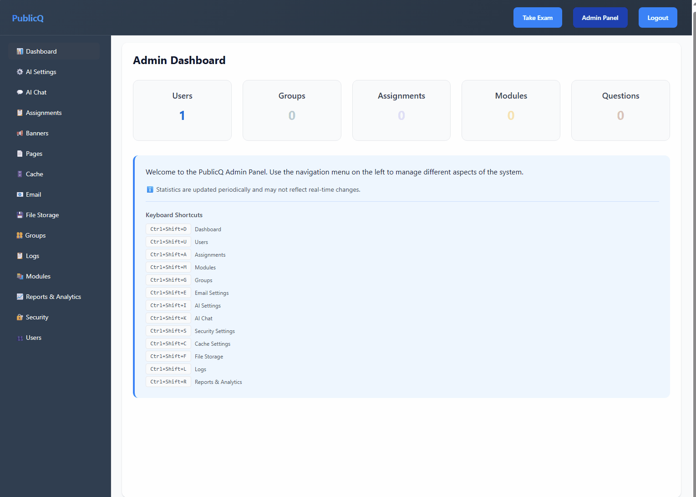
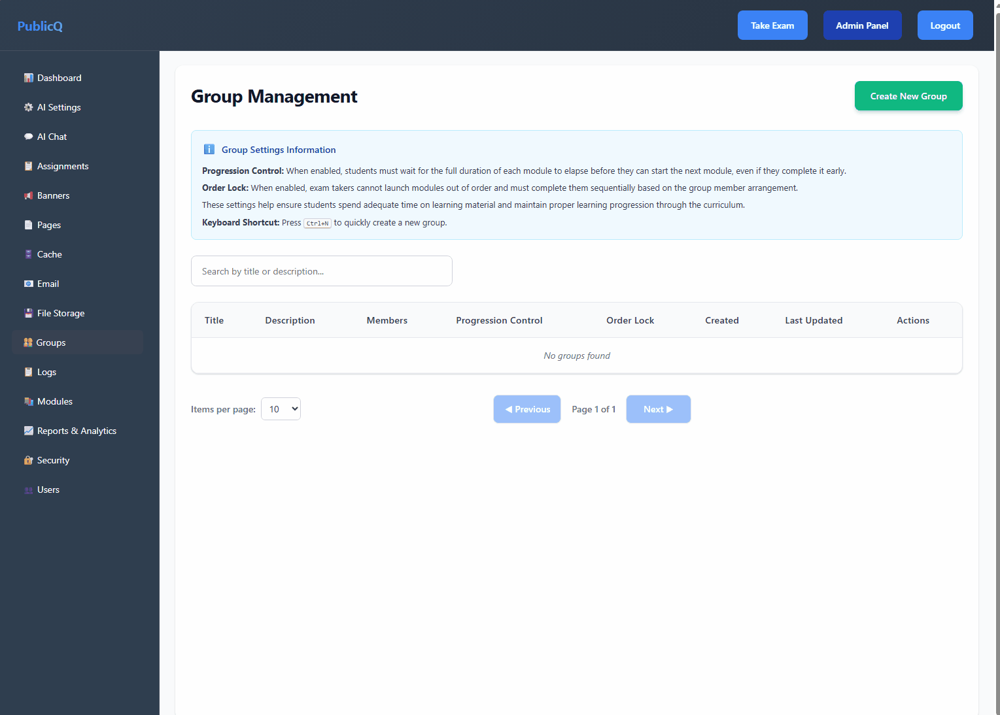
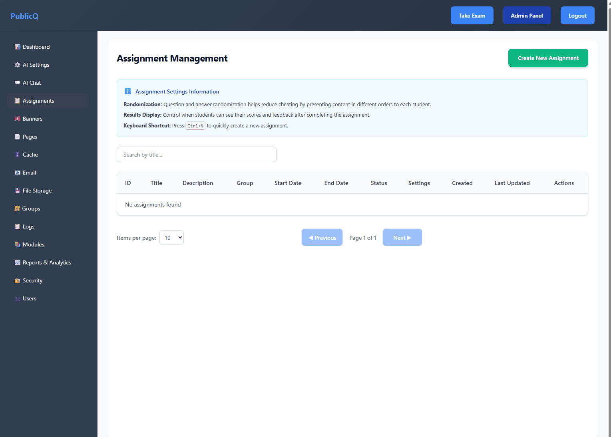
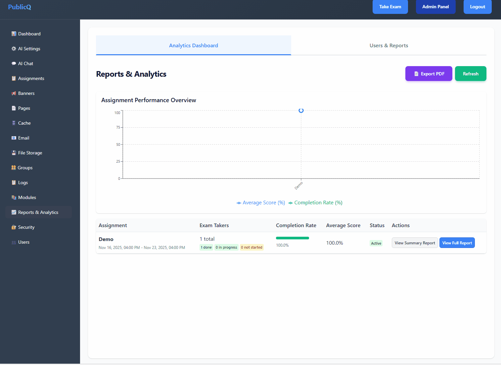
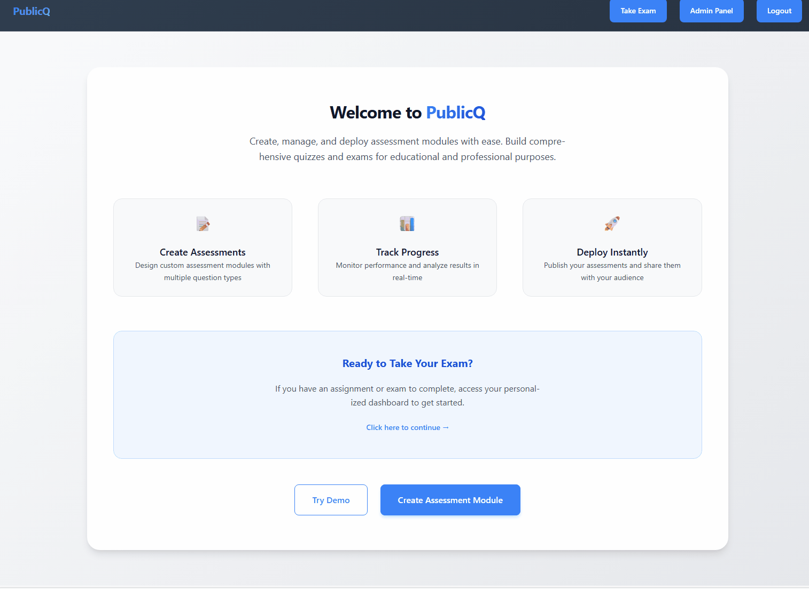

# PublicQ

[](https://dotnet.microsoft.com/)
[](https://reactjs.org/)
[](https://www.typescriptlang.org/)
[](LICENSE)

**PublicQ** is a comprehensive assessment platform designed for creating, managing, and deploying educational and professional assessments. Built with .NET 10 and React 19, it provides a complete solution for exam management with advanced features like versioning, role-based access control, real-time analytics, and AI-powered assistance.

## 🎯 **[See it in action! Try the live demo →](https://publicq.app)** ✨

## 📋 Table of Contents

- [Features](#-features)
- [Key Concepts](#-key-concepts--functionality)
- [Architecture](#%EF%B8%8F-architecture)
- [Quick Start](#-quick-start)
- [Feature Demonstrations](#-feature-demonstrations)
- [Usage Guide](#-usage-guide)
- [API Endpoints](#-api-endpoints)
- [Security](#-security-features)
- [Configuration](#-configuration)
- [Contributing](#-contributing)
- [License](#-license)

## ✨ Features

### 🎯 Core Assessment Management
- **Create Custom Assessments**: Build comprehensive assessment modules with multiple question types
- **Version Control**: Manage different versions of assessments with full revision history
- **Question Builder**: Create multiple-choice, true/false, and open-ended questions
- **File Attachments**: Add images, documents, and other static files to assignments, modules, questions and answers
- **Time Management**: Set duration limits and automatic submission

### 👥 User Management & Roles
- **Role-Based Access Control**: Seven distinct user roles with hierarchical permissions
  - **Exam Taker**: Take assigned assessments and view results
  - **Analyst**: View and analyze assessment data and reports
  - **Contributor**: Create and edit assessment modules with AI assistance
  - **Moderator**: Comprehensive user and content oversight
  - **Manager**: User administration, assignment coordination, and role management
  - **Administrator**: Full system access and configuration
- **Secure Authentication**: JWT-based authentication with role-based authorization
- **User Registration & Management**: Optional self-service registration (can be enabled/disabled) with admin approval workflow
- **Bulk User Import**: Download CSV template, fill with user data, and import users in bulk with optional assignment to specific assessments

### 📊 Assignment & Execution
- **Individual Assignment Distribution**: Assign assessments to specific exam takers (users)
- **Real-time Execution**: Live assessment taking with progress tracking
- **Automatic Scoring**: Instant results for objective questions
- **Session Management**: Resume interrupted assessments

### 📈 Analytics & Reporting
- **Detailed Reports**: Comprehensive assessment results and analytics
- **Performance Tracking**: Monitor individual and group performance
- **Platform Statistics**: System-wide usage and performance metrics
- **Export Capabilities**: Generate PDF reports and data exports

### 🤖 AI-Powered Features
- **AI Monkey 🐵**: Integrated AI chat for content creation and assistance
- **Model Context Protocol (MCP) Integration**: Native MCP server implementation for seamless AI assistant integration
  - **External MCP Clients**: VS Code Copilot, Claude Desktop use API key authentication with full platform access
  - **Web AI Chat**: Inherits user's JWT token and respects role-based permissions
  - Direct integration with VS Code, GitHub Copilot, and other MCP-compatible AI assistants
  - Context-aware operations for creating modules, questions, assignments, and managing users
- **Smart Question Generation**: AI-powered question suggestions and improvements
- **Content Analysis**: Automated assessment quality checks and recommendations

### 📢 Communication & Notifications
- **Banner Management**: System-wide announcements and notifications
- **User Alerts**: Configurable alerts for assignments and deadlines
- **Real-time Updates**: Live notifications for important events

### 🔧 Administration
- **System Configuration**: Customizable platform settings
- **Cache Management**: Redis-based caching for optimal performance
- **Logging System**: Comprehensive audit trails and system logs
- **File Management**: Centralized static file handling with size limits
- **Password Policy Management**: Configurable password complexity requirements
- **IP Rate Limiting**: Protection against abuse and DDoS attacks
- **Page Management**: Create and manage static pages (Contact Us, About, etc.) stored as JSON files for fast access without database queries

## � Key Concepts & Functionality

### 📚 Assessment Modules & Versions
**Assessment Modules** are the core educational content in PublicQ. Each module represents a distinct topic or subject area and can contain multiple versions:

- **Why Versions?**: Versions allow educators to iteratively improve assessments while maintaining historical records
  - Update questions based on student feedback or performance data
  - Create different difficulty levels for the same topic
  - Maintain compliance with changing educational standards
  - A/B test different question formats or content approaches
- **Backward Compatibility**: Previous assessment results remain linked to their specific version

### 👥 Groups & Organization
**Groups** in PublicQ serve as collections of assessment modules, not collections of users:

- **Module Organization**:
  - Groups contain multiple assessment modules that belong together
  - Define the sequence and structure of modules for assignments
  - Create logical groupings like "Mathematics Level 1" or "Safety Training"
- **Assignment Foundation**:
  - Assignments are created by selecting a group of modules
  - All modules in a group become part of the assignment
  - Provides consistent assessment structure across multiple assignments
- **Benefits**:
  - Simplified assignment creation by reusing module collections
  - Consistent assessment sequences for similar topics
  - Easier maintenance of related assessment content

### 📋 Assignments & Distribution
**Assignments** bridge assessment modules (via groups) and individual exam takers:

- **Assignment Creation Process**:
  1. Select a group of assessment modules
  2. Configure assignment settings (timing, randomization, etc.)
  3. Manually add individual exam takers to the assignment
  4. Publish the assignment to make it available
- **Individual Distribution**:
  - Assignments are distributed to specific individual users
  - Each user gets their own ExamTakerAssignment record
  - No bulk group-based assignment (administrators add users individually)
- **Assignment Lifecycle**:
  1. **Creation**: Admin/Moderator creates assignment from a module group
  2. **User Assignment**: Individual exam takers are manually added to the assignment
  3. **Publication**: Assignment is published to make it visible to assigned users
  4. **Execution**: Exam takers complete the assessment modules in the group
  5. **Evaluation**: Automatic scoring with manual review options
  6. **Reporting**: Individual and aggregate results analysis

### 🔐 Role-Based Access Control

#### 👤 **Exam Taker**
- **Primary Purpose**: Complete assigned assessments
- **Capabilities**:
  - View personal dashboard with pending/completed assignments
  - Take assessments within specified time limits
  - View own results and feedback
  - Track personal progress and performance history
- **Restrictions**: Cannot create content or access other users' data

#### 📊 **Analyst**
- **Primary Purpose**: Monitor and analyze assessment data
- **Capabilities**:
  - Generate comprehensive performance reports
  - View aggregated statistics across users and groups
  - Export data for external analysis
  - Monitor platform usage and engagement metrics
  - Access historical performance trends
- **Restrictions**: Cannot create assessments or manage users

#### ✍️ **Contributor**
- **Primary Purpose**: Create and manage educational content
- **Capabilities**:
  - Create new assessment modules and questions
  - Edit existing content they've created
  - Manage module versions and publishing status
  - Upload and organize static files (images, documents)
  - Preview assessments before publishing
  - Access AI chat assistant for content creation support
- **Restrictions**: Cannot assign assessments or manage users

#### 📋 **Manager**
- **Primary Purpose**: User administration and assignment coordination
- **Capabilities**:
  - All Contributor permissions (including AI chat access)
  - Create and manage user accounts
  - Assign roles up to Moderator level (cannot assign Administrator)
  - Modify/remove Moderator roles (but not Administrator)
  - Create and manage assignments
  - Manage banners and announcements
  - View reports and analytics
- **Restrictions**: 
  - Cannot assign or remove Administrator role
  - Cannot reset user passwords (Administrator only)
  - Cannot access system configuration settings

#### 🛡️ **Moderator**
- **Primary Purpose**: Comprehensive user and content oversight
- **Capabilities**:
  - All Manager permissions
  - Create and manage groups
  - Assign all roles except Administrator
  - Review and moderate user-generated content
  - Manage assessment scheduling and deadlines
  - Access to advanced moderation tools
- **Restrictions**: Cannot access system configuration or platform-wide settings

#### 👑 **Administrator**
- **Primary Purpose**: Full platform management and configuration
- **Capabilities**:
  - All permissions of other roles
  - System configuration and settings management
  - Platform-wide analytics and reporting
  - Cache management and performance optimization
  - User role management and permissions
  - System maintenance and troubleshooting
  - Backup and data management
  - Integration management and API configuration

### ⚙️ Administrative Configuration

#### 🔧 **System Settings**
- **Authentication Configuration**:
  - JWT token expiration and security settings
  - Password complexity requirements
  - Account lockout policies
  - Two-factor authentication options
- **Performance Optimization**:
  - Redis cache configuration and policies
  - Database connection pooling
  - File upload size limits and restrictions
  - Session timeout settings

#### 📊 **Assessment Configuration**:
- **Default Module Settings**:
  - Standard passing score percentages
  - Default time limits for assessments
  - Question randomization options
  - Retake policies and attempt limits
- **Scoring and Feedback**:
  - Immediate vs. delayed result disclosure
  - Partial credit scoring for complex questions
  - Custom feedback templates and messaging
  - Grade book integration options

#### 🗃️ **Data Management**:
- **File Storage Configuration**:
  - Upload directories and file organization
  - Supported file types and security scanning
  - Automatic cleanup policies for temporary files
  - CDN integration for static content delivery
- **Backup and Archival**:
  - Automated database backup schedules
  - Data retention policies
  - Export formats and scheduling
  - Historical data preservation settings

#### 🔐 **Security & Compliance**:
- **Access Control**:
  - IP-based access restrictions
  - Session management and concurrent login policies
  - Audit trail configuration and retention
  - Privacy settings and data protection compliance
- **Monitoring & Alerts**:
  - System health monitoring thresholds
  - Performance alert configurations
  - Security incident detection and reporting
  - Automated maintenance scheduling

## 🏗️ Architecture

### Backend (.NET 10)
- **Clean Architecture**: Separated into Domain, Application, Infrastructure, and API layers
- **Entity Framework Core**: SQLite database for simplicity - can be easily changed to any EF-supported provider (PostgreSQL, MySQL, SQL Server, etc.)
- **CQRS Pattern**: Command Query Responsibility Segregation for scalable operations
- **FluentValidation**: Comprehensive input validation
- **Redis Caching**: Performance optimization with distributed caching
- **Swagger/OpenAPI**: Comprehensive API documentation
- **Minimal API**: Modern .NET API patterns with performance optimization

### Frontend (React 19)
- **Modern React**: Hooks-based architecture with TypeScript
- **React Router v7**: Client-side routing with role-based guards
- **Responsive Design**: Mobile-first approach with CSS Modules
- **Context API**: State management for authentication and global state
- **Axios**: HTTP client for API communication
- **Recharts**: Data visualization and analytics charts
- **HTML2Canvas & jsPDF**: Client-side report generation

## 🚀 Quick Start

### Easiest Way: Docker

Run PublicQ with a single command using the pre-built Docker image:

```bash
docker run -d \
  --name publicq \
  -p 8080:8080 \
  -v publicq_data:/app/data \
  -v publicq_uploads:/app/uploads \
  mtokarevv/publicq-app:latest
```

Access the application at http://localhost:8080

**Data Persistence:**
The Docker volumes (`publicq_data` and `publicq_uploads`) ensure your data persists across container updates:
- `publicq_data` - SQLite database and application data
- `publicq_uploads` - User-uploaded files (images, documents, static files)

**Updating to a Newer Version:**
```bash
# Stop and remove the old container
docker stop publicq && docker rm publicq

# Pull the latest image
docker pull mtokarevv/publicq-app:latest

# Run with the same volumes to preserve all data
docker run -d \
  --name publicq \
  -p 8080:8080 \
  -v publicq_data:/app/data \
  -v publicq_uploads:/app/uploads \
  mtokarevv/publicq-app:latest
```

Your database, user accounts, assessments, and all uploaded files will be preserved!

**Optional: Add Redis for caching**
```bash
docker run -d --name publicq-redis redis:7-alpine
docker run -d \
  --name publicq \
  -p 8080:8080 \
  --link publicq-redis:redis \
  -e ConnectionStrings__Redis=redis:6379 \
  -v publicq_data:/app/data \
  -v publicq_uploads:/app/uploads \
  mtokarevv/publicq-app:latest
```

### Prerequisites (for local development)
- [.NET 10 SDK](https://dotnet.microsoft.com/download/dotnet/10.0)
- [Node.js 20+](https://nodejs.org/)
- [Redis](https://redis.io/download) (optional for caching)
- [Docker](https://www.docker.com/) (optional, for containerized deployment)

### Local Development Setup

1. **Clone the repository**
   ```bash
   git clone <repository-url>
   cd publicq
   ```

2. **Build Frontend** (one-time setup)
   ```bash
   cd client
   npm install
   npm run build
   cd ..
   ```

3. **Backend Setup & Run**
   ```bash
   cd src/PublicQ.API
   dotnet restore
   dotnet ef database update --context ApplicationDbContext
   dotnet run
   ```

   The backend will automatically serve the built frontend from the `wwwroot` directory.

4. **Access the application**
   - Application: http://localhost:5188 (frontend + backend)
   - API Documentation: http://localhost:5188/swagger

   **Note:** No need to run a separate frontend development server. The backend serves the React application directly.

5. **Try the Demo**
   - Click "Try Demo" button on the homepage to experience the platform
   - Demo provides a sample assessment without requiring registration
   - Explore different question types and assessment features

### Default Admin Account

On first run, the system creates a default administrator account:

- **Email**: `admin@publicq.local`
- **Password**: `admin`

⚠️ **Important**: Change the default password immediately after first login for security purposes.

To create additional admin accounts or modify roles, use the User Management section in the admin panel.

### Docker Deployment

For production deployment, use Docker Compose:

```bash
docker-compose up -d
```

This will start:
- PublicQ application on port 8080
- Redis cache on port 6379 (with 256MB memory limit)
- Persistent volumes for:
  - SQLite database (`app_data`)
  - User uploads (`app_uploads`)
  - Redis data (`redis_data`)

**Upgrading with Docker Compose:**
```bash
# Pull latest images
docker-compose pull

# Recreate containers with new images (data is preserved in volumes)
docker-compose up -d

# Verify the update
docker-compose logs -f publicq
```

All data (database, uploads, cache) is stored in named Docker volumes and will persist across container updates.

### Troubleshooting

**Database Issues:**
```bash
# Reset database (warning: deletes all data)
cd src/PublicQ.API
dotnet ef database drop --context ApplicationDbContext
dotnet ef database update --context ApplicationDbContext
```

**Port Conflicts:**
- Frontend default: 3000 (can be changed in `client/.env`)
- Backend default: 5188 (can be changed in `appsettings.json`)
- Docker: 8080 (can be changed in `docker-compose.yml`)

**Cache Issues:**
```bash
# Clear Redis cache
redis-cli FLUSHALL
```

## 🎬 Feature Demonstrations

### User Management
Create and manage user accounts with role-based permissions:



### Module Creation
Build comprehensive assessment modules with questions and answers:


### Group Organization
Organize modules into logical groups for assignment distribution:



### Assignment Creation
Create and distribute assignments to exam takers:



### Exam Taking Process
Experience the full exam-taking workflow with progress tracking:


### Reporting & Analytics
Generate comprehensive performance reports and track student progress:



### Banner Management
Create and manage system-wide announcements and notifications:



### AI-Powered Assistance
Use AI Monkey 🐵 for content creation and question generation:


## 📚 Usage Guide

### For Exam Takers
1. **Registration**: Create an account or use provided credentials
2. **Access Assignments**: View available assessments on the dashboard
3. **Take Assessments**: Complete assigned exams within the time limit
4. **View Results**: Check scores and feedback immediately after completion

### For Contributors (Content Creators)
1. **Create Modules**: Design new assessment modules with titles and descriptions
2. **Add Questions**: Build comprehensive question sets with multiple choice, true/false, or open-ended formats
3. **Attach Files**: Include images, documents, or other supporting materials
4. **Version Management**: Create and manage different versions of assessments
5. **Publish**: Release assessments for assignment to exam takers

### For Administrators
1. **User Management**: Create, edit, and manage user accounts and roles
   - **Bulk User Import**: Download CSV template, populate with user data (email, name, date of birth), and import multiple users at once
   - Optionally assign imported users to a specific assignment during import
   - System validates and creates exam taker accounts in bulk
2. **System Configuration**: Configure platform settings and parameters
3. **Assignment Management**: Create and distribute assignments to users or groups
4. **Analytics**: Monitor platform usage and assessment performance
5. **Maintenance**: Manage cache, logs, and system health
6. **Page Management**: Create and customize static pages (Contact Us, About, Terms, etc.) with structured content

## 🔧 API Documentation

PublicQ provides comprehensive RESTful API endpoints for all platform functionality. For detailed API documentation including request/response schemas, authentication requirements, and interactive testing:

**Access Swagger Documentation:**
- Local Development: http://localhost:5188/swagger
- Docker: http://localhost:8080/swagger

**API Coverage:**
- Authentication & User Management
- Assessment Module CRUD operations
- Assignment creation and execution
- Reporting and analytics
- Banner management
- AI chat integration
- Page management
- Platform statistics

All endpoints require appropriate authentication and respect role-based access control.

### Model Context Protocol (MCP) Server
PublicQ includes a built-in MCP server that enables AI assistants (like GitHub Copilot, Claude Desktop, etc.) to interact directly with the platform:

**Authentication Methods:**
- **External MCP Clients** (VS Code, Copilot, Claude Desktop): Use API key authentication with full platform access
  - Configure API key in `.vscode/mcp.json` or MCP client settings
  - API key provides administrator-level permissions for all operations
  - Ideal for development and content creation workflows
- **Web-Based AI Chat**: Inherits the logged-in user's JWT token
  - Respects user's role-based access control
  - AI can only perform actions the user has permission to execute

**Available MCP Tools:**
- `CreateModule` - Create assessment modules (requires Contributor+ role)
- `CreateQuestion` - Add questions to modules (requires Contributor+ role)
- `GetModule` - Retrieve module details for review
- `SearchUsers` - Find users by email or ID (requires Contributor+ role)
- `GetExamTakerReport` - Generate student performance reports (requires Analyst+ role)
- `UploadFilesToModule` - Attach images/files to questions

**Configuration:** MCP server settings available in `.vscode/mcp.json` for VS Code integration

## 🔒 Security Features

- **JWT Authentication**: Secure token-based authentication
- **Role-Based Authorization**: Granular permissions based on user roles
- **Input Validation**: Comprehensive validation using FluentValidation
- **SQL Injection Prevention**: Entity Framework parameterized queries
- **File Upload Security**: Restricted file types and size limits

## 🎨 Configuration

### Architecture Overview

PublicQ uses a **database-first configuration approach**. Most application settings are stored in the database and can be managed through the admin panel, providing:
- Runtime configuration changes without redeployment
- Per-environment settings through the UI
- Audit trail of configuration changes
- No sensitive data in configuration files

### Environment Variables

**Backend (minimal configuration in `appsettings.json` or environment variables):**
```bash
# Essential runtime configuration
ASPNETCORE_ENVIRONMENT=Production
ASPNETCORE_URLS=http://+:8080

# Database connection (required - only setting in appsettings.json)
ConnectionStrings__DefaultConnection=Data Source=/app/data/publicq.db

# Optional: Logging level
Logging__LogLevel__Default=Information
```

**Note:** Redis cache connection and all other settings are configured through the Admin Panel and stored in the database.

**Frontend (`.env` file in `client/` directory):**
```bash
REACT_APP_API_URL=http://localhost:5188
REACT_APP_VERSION=$npm_package_version
```

### Database-Managed Settings

The following settings are configured through the Admin Panel and stored in the database:

**Security & Authentication:**
- JWT token settings (secret, issuer, audience, expiry)
- Password policy (complexity, length, requirements)
- Session timeout and concurrent login policies
- IP rate limiting rules
- Self-service user registration (enable/disable)

**Email Configuration:**
- SMTP provider settings
- Email templates
- Sender information

**Cache Configuration:**
- Redis connection string
- Cache enable/disable
- Key prefix
- TTL and retention policies

**Application Features:**
- File upload size limits
- Assessment default settings (passing score, duration)
- Banner and notification preferences

**AI Configuration:**
- AI Monkey settings
- API keys (encrypted)
- Model preferences

Access these settings through: **Admin Panel → Security/Email/Cache/Storage/AI Settings**

## 🤝 Contributing

### Development Workflow
1. Fork the repository
2. Create a feature branch: `git checkout -b feature/new-feature`
3. Make your changes following the coding standards
4. Test thoroughly (backend and frontend)
5. Commit changes with clear messages: `git commit -am 'Add new feature'`
6. Push to branch: `git push origin feature/new-feature`
7. Submit a pull request with description of changes

### Coding Standards

**Backend (.NET):**
- Follow clean architecture principles
- Use async/await for I/O operations
- Implement proper error handling and validation
- Add XML documentation comments for public APIs
- Use FluentValidation for input validation
- Write unit tests for business logic

**Frontend (React/TypeScript):**
- Use TypeScript with strict mode
- Minimize use of `any` and `undefined` types
- Use functional components with hooks
- Implement proper error boundaries
- Use CSS Modules for component styling
- Follow component composition patterns
- Avoid console.log in production code

**Database:**
- Use Entity Framework migrations for schema changes
- Add indexes for frequently queried columns
- Implement soft deletes where appropriate
- Add audit fields (CreatedAt, UpdatedAt, CreatedBy)

### Testing

🚧 **Coming Soon** - Comprehensive test suite is currently in development.

Planned test coverage:
- Unit tests for business logic and services
- Integration tests for API endpoints
- Frontend component tests
- End-to-end testing for critical user workflows

## 🗺️ Roadmap

### Planned Features
- **Enhanced Concurrency Control**: Optimistic concurrency tokens for conflict resolution
- **Token Management**: Refresh tokens, token revocation, and certificate rotation
- **Email Notifications**: Automatic notifications for assignment changes and deadlines
- **Advanced Progress Tracking**: Visual progress bars with color-coded question states
- **Question Navigation**: Click-to-jump on progress bar, unanswered question list
- **Mobile Optimization**: Enhanced mobile experience for all components
- **Contact Form**: User feedback and support request system
- **SSL Management**: User-configurable SSL certificates
- **Role Expansion**: Additional specialized roles for workflow management
- **AI Enhancements**: Expanded AI capabilities for content creation

See [BACKLOG.MD](BACKLOG.MD) for detailed feature tracking.

## 📞 Support

For issues, questions, or contributions:
- **Issues**: [GitHub Issues](https://github.com/yourusername/publicq/issues)
- **Discussions**: [GitHub Discussions](https://github.com/yourusername/publicq/discussions)
- **Documentation**: Check `/docs` folder for detailed guides

### Custom Features & Professional Services

Need help with deployment, custom features, or professional support?

📧 **Contact us**: [publicq-app@outlook.com](mailto:publicq-app@outlook.com)

We offer:
- Custom feature development
- Deployment assistance and configuration
- Professional support and maintenance
- Integration with existing systems

## 🙏 Acknowledgments

Built with:
- [.NET](https://dotnet.microsoft.com/) - Backend framework
- [React](https://reactjs.org/) - Frontend library
- [Entity Framework Core](https://docs.microsoft.com/en-us/ef/core/) - ORM
- [Redis](https://redis.io/) - Caching layer
- [Recharts](https://recharts.org/) - Data visualization
- [React Router](https://reactrouter.com/) - Navigation

### 🎨 Icons

**Important Notice**: All icons used in this project (`/client/public/images/icons/`) have been purchased and are licensed for use **exclusively within this project**. 

⚠️ **Usage Restrictions:**
- ✅ **Allowed**: Use icons if you fork this repository and continue working on the PublicQ project
- ❌ **Prohibited**: Redistribute, reuse, or reproduce these icons in other projects or products
- ❌ **Prohibited**: Extract icons for use in unrelated applications or commercial products

These icons are proprietary assets and are not covered by the project's open-source license. They may only be used as part of PublicQ or its direct derivatives.

For icon licensing inquiries or commercial use, please contact the project maintainer.

## 📄 License

This project is licensed under the MIT License - see the [LICENSE](LICENSE) file for details.

**Note:** Icons located in `/client/public/images/icons/` are licensed separately and are not covered by the MIT license. See the [Icons](#-icons) section above for details.

---

Made with ❤️ by the Mikhail Tokarev

## 🔍 Technical Notes

### Default Configuration
- **Message Template ID**: `f2a1a4c8-8e6a-4f1c-b9f8-9f2c4c622dd9` (used for standardized communications)
- **Default Admin Account**: Create via user registration, then manually update role in database
- **Database**: SQLite by default (`db/publicq.db`) - easily switchable to PostgreSQL, MySQL, SQL Server, or any EF Core supported provider
- **Upload Directory**: `static/`
- **Cache TTL**: Configurable per cache type (default: 5-60 minutes)

### Performance Optimization
- **Redis Caching**: Distributed caching with LRU eviction policy (256MB limit)
- **Lazy Loading**: Related entities loaded on-demand
- **Database Indexing**: Optimized queries with proper indexes
- **Frontend Optimization**:
  - Code splitting and lazy loading
  - Route-based code splitting with React Router
  - Optimized bundle sizes
  - Image optimization and lazy loading
- **API Optimization**:
  - Response compression
  - Rate limiting for public endpoints
  - Efficient pagination
  - Selective field projection

### Logging
- Comprehensive logging with structured data
- Error tracking and reporting
- Audit trails for security compliance